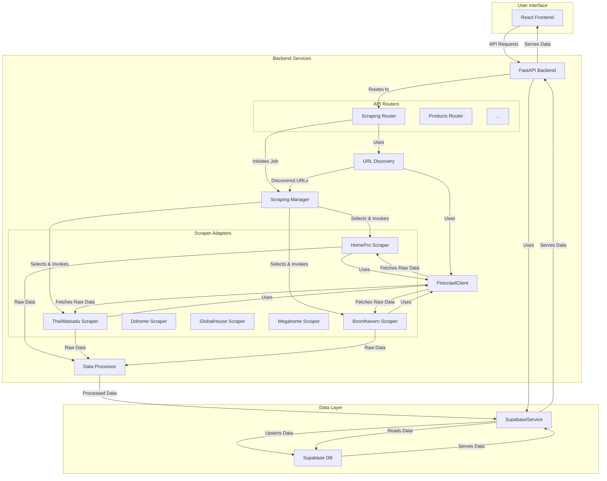
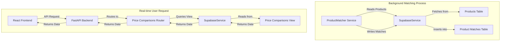

# System Architecture

This document outlines the architecture of the RIS Data Scraping application, detailing the flow of data and control from the user interface to the database.

## Components

The system is composed of the following key components:

- **Frontend:** A React-based single-page application (SPA) that provides the user interface for interacting with the system.
- **Backend:** A Python-based API built with FastAPI that handles business logic, data processing, and communication with other services.
- **API Routers:** Separate routers for different API endpoints (e.g., `products`, `scraping`, `analytics`).
- **Scraping Manager:** A manager that orchestrates scraping jobs, either for a single retailer or multiple retailers in a batch.
- **Scraper Adapters:** A collection of retailer-specific scrapers that act as adapters to handle the unique structure of each retailer's website.
- **FirecrawlClient:** A client for interacting with the Firecrawl service to fetch website data.
- **DataProcessor:** A component for cleaning, validating, and structuring scraped data.
- **SupabaseService:** A service for all database interactions with the Supabase PostgreSQL database.
- **URLDiscovery:** A component for finding product URLs on category and search pages.

## Architecture Flow

The following diagram illustrates the detailed architecture of the system:

## Detailed Flow

1.  **User Interaction:** The user interacts with the React frontend to initiate actions such as starting a scrape, viewing products, or analyzing data.
2.  **API Communication:** The frontend sends API requests to the FastAPI backend.
3.  **Routing:** The FastAPI backend routes the incoming request to the appropriate API router (e.g., `/api/scraping/jobs` goes to the `Scraping Router`).
4.  **Scraping Job Creation:**
    - The `Scraping Router` receives the request and creates a new scraping job in the database via the `SupabaseService`.
    - It then starts a background task to run the scraping job, managed by the `Scraping Manager`.
5.  **Scraping Execution (Adapter Pattern):**
    - The `Scraping Manager` selects the appropriate retailer-specific scraper (e.g., `HomeProScraper`, `ThaiWatsaduScraper`) based on the job parameters. Each scraper acts as an **adapter** for a specific retailer.
    - The selected scraper adapter uses the `FirecrawlClient` to fetch the raw HTML and data from the target website.
6.  **Data Processing:**
    - The raw data from Firecrawl is passed to the `DataProcessor`.
    - The `DataProcessor` cleans, validates, and transforms the data into a standardized `Product` model.
7.  **Data Storage:**
    - The processed `Product` data is sent to the `SupabaseService`, which then upserts the data into the `products` table in the Supabase database.
    - If the price of an existing product has changed, a new entry is added to the `price_history` table.
8.  **URL Discovery:**
    - For category-wide scrapes, the `Scraping Router` can use the `URLDiscovery` service.
    - `URLDiscovery` also uses `FirecrawlClient` to scrape category pages and extract all product URLs.
    - These discovered URLs are then passed back to the `Scraping Manager` to be scraped.
9.  **Data Retrieval:**
    - When the user wants to view products or analytics, the frontend sends a request to the appropriate router (e.g., `Products Router`).
    - The router uses the `SupabaseService` to query the database.
    - The data is then returned to the frontend for display.

This architecture provides a clear separation of concerns, making the system modular, scalable, and easy to maintain.

## Price Comparison Flow

The price comparison feature is a two-part process: a background job for matching products and a real-time flow for user requests.

### Price Comparison Architecture

### 1. Background Matching Process

This process runs periodically to find and link identical products from different retailers.

1.  **Initiation:** A background job triggers the `ProductMatcher` service.
2.  **Product Retrieval:** The `ProductMatcher` uses the `SupabaseService` to fetch all products from the `products` table.
3.  **Normalization and Hashing:** For each product, the `ProductMatcher` normalizes the name and brand and generates a `product_hash`.
4.  **Candidate Selection:** It then groups products by their `product_hash` to find potential matches.
5.  **Confidence Scoring:** For each group of potential matches, it calculates a `match_confidence` score based on name similarity, brand match, category match, and other criteria.
6.  **Match Creation:** If the confidence score is high enough, the `ProductMatcher` creates a new entry in the `product_matches` table, linking the master product with its matches.

### 2. Real-time User Request Flow

This is the flow when you request a price comparison from the user interface.

1.  **User Interaction:** You navigate to the price comparison section of the React frontend and make a request (e.g., view top savings, compare a category).
2.  **API Communication:** The frontend sends an API request to the `price_comparisons` router in the FastAPI backend.
3.  **Data Retrieval:**
    - The `Price Comparisons Router` receives the request.
    - It then uses the `SupabaseService` to query the pre-built `price_comparisons` view in the database. This view simplifies the query by pre-joining the `products` and `product_matches` tables.
4.  **Response:**
    - The `SupabaseService` returns the data from the view to the router.
    - The router formats the data into a JSON response and sends it back to the frontend.
5.  **Display:** The React frontend receives the JSON data and displays it in a user-friendly format (e.g., a table of price comparisons).
