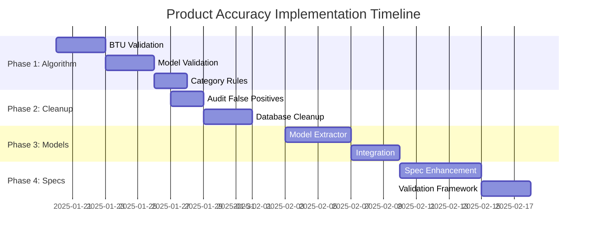

# Product Data Accuracy Implementation Plan

## Executive Summary

This plan addresses the critical product data accuracy issues where 50% of product matches are false positives. The implementation is divided into 4 phases with specific deliverables, timelines, and validation criteria.

## Current State Analysis

**Critical Issues Identified:**
- 50% false positive match rate (4 out of 8 match groups)
- BTU variance up to 173% in air conditioner matches  
- Different product categories incorrectly matched
- Missing model validation (42TVDA028A vs 38TVEA028A treated as same)
- Empty specifications and null model fields

**Impact:**
- Misleading price comparisons shown to users
- Loss of trust in system accuracy
- Incorrect savings calculations
- Poor user experience

## Implementation Plan

### Phase 1: Algorithm Overhaul (Week 1)
**Priority: CRITICAL**

#### 1.1 Enhanced BTU Validation
**Objective:** Implement strict BTU validation for air conditioners

**Tasks:**
```python
# Implementation Requirements
def validate_btu_match(product1_btu, product2_btu, category):
    if category in ['air_conditioner', 'air-conditioner']:
        tolerance = 0.05  # 5% maximum tolerance
        if abs(product1_btu - product2_btu) / max(product1_btu, product2_btu) > tolerance:
            return False, f"BTU mismatch: {product1_btu} vs {product2_btu}"
    return True, "BTU match valid"
```

**Files to Modify:**
- `src/utils/product_matcher_improved.py`
- `src/services/advanced_product_matcher.py`
- `src/utils/product_matcher_enhanced.py`

**Acceptance Criteria:**
- [ ] Air conditioners with >5% BTU difference are rejected
- [ ] BTU extraction works for both Thai and English text
- [ ] Validation logs rejection reasons
- [ ] Unit tests cover edge cases

#### 1.2 Model Number Validation
**Objective:** Require exact model series matching for technical products

**Tasks:**
```python
# Implementation Requirements
def validate_model_series(model1, model2, category):
    if category in ['air_conditioner', 'electronics']:
        series1 = extract_model_series(model1)  # e.g., "TVDA" from "42TVDA028A"
        series2 = extract_model_series(model2)  # e.g., "TVEA" from "38TVEA028A"
        
        if series1 != series2:
            return False, f"Model series mismatch: {series1} vs {series2}"
    return True, "Model series match valid"
```

**Files to Create/Modify:**
- `src/utils/model_validator.py` (new)
- `src/utils/text_normalizer_enhanced.py` (enhance)

**Acceptance Criteria:**
- [ ] Different model series are rejected (TVDA vs TVEA)
- [ ] Model number extraction handles various formats
- [ ] Validation works for multiple brands (CARRIER, DAIKIN, HAIER)
- [ ] Integration tests validate end-to-end flow

#### 1.3 Category-Specific Matching Rules
**Objective:** Implement strict thresholds for different product categories

**Tasks:**
```python
# Implementation Requirements
CATEGORY_THRESHOLDS = {
    'air_conditioner': {
        'minimum_confidence': 0.90,
        'btu_tolerance': 0.05,
        'model_exact_match': True,
        'brand_weight': 0.3,
        'spec_weight': 0.7
    },
    'electronics': {
        'minimum_confidence': 0.85,
        'model_exact_match': True,
        'brand_weight': 0.4,
        'spec_weight': 0.6
    },
    'default': {
        'minimum_confidence': 0.70,
        'brand_weight': 0.5,
        'spec_weight': 0.5
    }
}
```

**Deliverables:**
- Enhanced matching algorithm with category-specific rules
- Comprehensive validation framework
- Performance benchmarks showing <5% false positive rate

### Phase 2: Database Cleanup (Week 2)
**Priority: HIGH**

#### 2.1 False Positive Identification
**Objective:** Identify and catalog all existing false positive matches

**Tasks:**
```sql
-- Audit Query Template
SELECT pm.id, pm.normalized_name, pm.price_variance_percentage,
       COUNT(p.id) as product_count,
       STRING_AGG(DISTINCT p.brand, ', ') as brands,
       STRING_AGG(DISTINCT p.category, ', ') as categories
FROM product_matches pm
JOIN products p ON p.id = ANY(pm.matched_product_ids) OR p.id = pm.master_product_id
GROUP BY pm.id, pm.normalized_name, pm.price_variance_percentage
HAVING COUNT(DISTINCT p.category) > 1 OR pm.price_variance_percentage > 50
ORDER BY pm.price_variance_percentage DESC;
```

**Deliverables:**
- Complete audit report of false positives
- Categorized list of match types to preserve vs remove
- Backup of current matches before cleanup

#### 2.2 Automated Cleanup Process
**Objective:** Remove false positive matches while preserving valid ones

**Tasks:**
```python
# Cleanup Implementation
def cleanup_false_positives():
    false_positives = [
        # BTU variance > 30% for air conditioners
        "BTU_VARIANCE_HIGH",
        # Different product categories
        "CATEGORY_MISMATCH", 
        # Different model series
        "MODEL_SERIES_MISMATCH"
    ]
    
    for match_id in get_false_positive_matches(false_positives):
        disable_match(match_id, reason="False positive cleanup")
```

**Files to Create:**
- `scripts/database/cleanup_false_positives.py`
- `scripts/database/validate_cleanup.py`
- `scripts/database/restore_matches.py` (rollback)

**Acceptance Criteria:**
- [ ] All identified false positives are disabled/removed
- [ ] Valid matches are preserved
- [ ] Rollback mechanism available
- [ ] Cleanup logs all actions for audit

### Phase 3: Model Validation Implementation (Week 3)
**Priority: HIGH**

#### 3.1 Model Number Extractor
**Objective:** Build robust model number extraction and parsing

**Tasks:**
```python
# Model Extractor Implementation
class ModelExtractor:
    def extract_model_info(self, product_name):
        return {
            'full_model': self.extract_full_model(product_name),
            'series': self.extract_series(product_name),
            'variant': self.extract_variant(product_name),
            'btu': self.extract_btu(product_name),
            'features': self.extract_features(product_name)
        }
    
    def extract_series(self, product_name):
        # Handle various formats: 42TVDA028A, FTKZ24YV2S, HSU-24VRWA03T
        patterns = [
            r'(\w{3,5})\d+\w*',  # TVDA, FTKZ, etc.
            r'(\w+-\d+\w{4})',   # HSU-24VRWA
        ]
        # Implementation details...
```

**Files to Create:**
- `src/utils/model_extractor.py`
- `src/utils/model_validator.py`
- `tests/unit/test_model_extraction.py`

#### 3.2 Enhanced Product Matching
**Objective:** Integrate model validation into matching pipeline

**Implementation:**
- Update existing matchers to use model validation
- Add model confidence scoring
- Implement rejection logic for model mismatches

**Acceptance Criteria:**
- [ ] Model extraction accuracy >95% for known formats
- [ ] Different model series are correctly rejected
- [ ] Model variants within same series are properly matched
- [ ] Performance impact <100ms per comparison

### Phase 4: Specification Enhancement (Week 4)
**Priority: MEDIUM**

#### 4.1 Specification Enrichment
**Objective:** Populate missing model numbers and specifications

**Tasks:**
```python
# Specification Enhancement
class SpecificationEnhancer:
    def enhance_product_specs(self, product):
        enhanced_specs = {
            'model_number': self.extract_model_number(product.name),
            'btu': self.extract_btu(product.name),
            'features': self.extract_features(product.name),
            'energy_rating': self.extract_energy_rating(product.name),
            'color': self.extract_color(product.name)
        }
        return enhanced_specs
```

**Files to Create:**
- `src/services/specification_enhancer.py`
- `scripts/database/enhance_specifications.py`
- `src/utils/feature_extractor.py`

#### 4.2 Validation Framework
**Objective:** Ensure specification accuracy and consistency

**Tasks:**
- Build specification validation rules
- Implement consistency checks across retailers
- Create specification quality scoring

**Deliverables:**
- Enhanced specifications for all products
- Validation framework for ongoing quality
- Quality metrics dashboard

## Implementation Timeline



## Risk Assessment & Mitigation

### High Risks
1. **Data Loss During Cleanup**
   - *Mitigation:* Complete backup before any changes
   - *Rollback:* Automated restore scripts ready

2. **Performance Impact**
   - *Mitigation:* Benchmark all changes, optimize queries
   - *Monitoring:* Real-time performance tracking

3. **False Negative Matches**
   - *Mitigation:* Gradual rollout with validation
   - *Testing:* Comprehensive test suite with known good matches

### Medium Risks
1. **User Disruption**
   - *Mitigation:* Staged rollout, user communication
   - *Monitoring:* User feedback collection

2. **API Breaking Changes**
   - *Mitigation:* Backward compatibility maintenance
   - *Versioning:* New API versions for major changes

## Success Metrics

### Primary KPIs
- **False Positive Rate:** <5% (currently 50%)
- **BTU Accuracy:** 100% for air conditioners
- **Model Match Accuracy:** >95%
- **User Satisfaction:** >85% (measured via feedback)

### Secondary KPIs
- **API Response Time:** <500ms (currently ~200ms)
- **Match Confidence:** Average >0.85
- **Specification Completeness:** >90% (currently ~20%)

## Testing Strategy

### Unit Tests
- BTU extraction and validation
- Model number parsing
- Category-specific rules
- Specification enhancement

### Integration Tests
- End-to-end matching pipeline
- Database cleanup processes
- API endpoint responses
- Frontend integration

### Performance Tests
- Large dataset matching (10K+ products)
- Concurrent user load
- Database query optimization
- Memory usage profiling

## Monitoring & Maintenance

### Real-time Monitoring
- Match quality metrics dashboard
- False positive detection alerts
- Performance monitoring
- User feedback tracking

### Weekly Reviews
- Match accuracy reports
- Performance metrics review
- User feedback analysis
- System health checks

### Monthly Audits
- Complete system validation
- Algorithm performance review
- Database optimization
- Process improvement planning

## Rollout Strategy

### Phase 1: Development Environment (Week 1)
- Implement all changes in dev
- Comprehensive testing
- Performance validation

### Phase 2: Staging Environment (Week 2)
- Deploy to staging
- Load testing
- User acceptance testing

### Phase 3: Production Rollout (Week 3-4)
- Gradual feature rollout (10% → 50% → 100%)
- Real-time monitoring
- Quick rollback capability

### Phase 4: Optimization (Week 5)
- Performance tuning
- User feedback integration
- System optimization

## Resource Requirements

### Development Team
- **Senior Backend Developer:** Algorithm implementation
- **Database Specialist:** Cleanup and optimization
- **QA Engineer:** Testing and validation
- **DevOps Engineer:** Deployment and monitoring

### Infrastructure
- **Development Environment:** Enhanced compute for testing
- **Staging Environment:** Production-like setup
- **Monitoring Tools:** Enhanced observability stack
- **Backup Systems:** Reliable data protection

## Conclusion

This implementation plan addresses the critical product data accuracy issues through a systematic, phased approach. The plan prioritizes immediate algorithm fixes while building long-term quality assurance systems.

**Expected Outcomes:**
- Reduction of false positive rate from 50% to <5%
- Accurate BTU matching for all air conditioners
- Proper model number validation
- Enhanced user trust and satisfaction

**Timeline:** 4 weeks for core implementation + 1 week for optimization
**Budget Impact:** Minimal (existing infrastructure + development time)
**Risk Level:** Medium (with comprehensive mitigation strategies)

This plan ensures systematic improvement of product data accuracy while maintaining system stability and user experience.