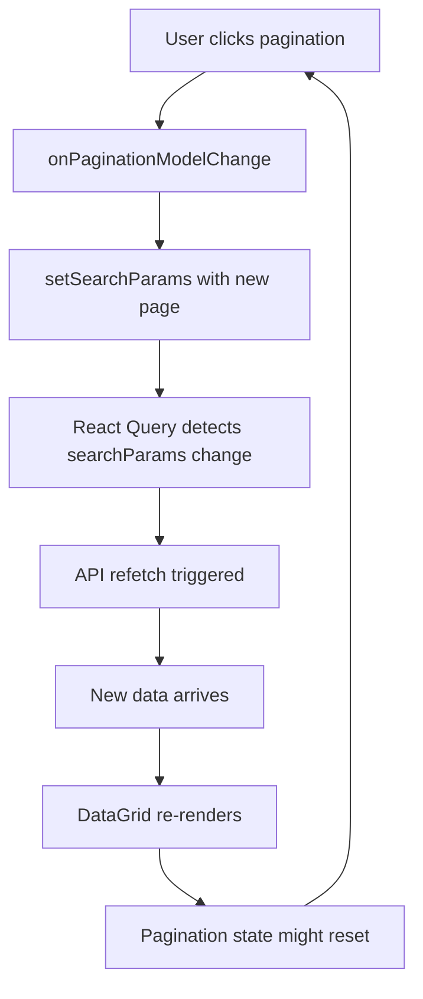

# Pagination Loop Fix Report

## Issue Description
**Problem**: Pagination on the Products page (`/products`) was experiencing a "looping back to previous page" behavior when users clicked to navigate between pages.

**Symptoms**:
- Users click "Next" but the page reverts to the previous page
- Inconsistent pagination state
- Potential infinite re-renders causing poor UX

## Root Cause Analysis

### Technical Investigation
1. **DataGrid Pagination**: Uses 0-based indexing (`page: 0, 1, 2...`)
2. **API Pagination**: Uses 1-based indexing (`page: 1, 2, 3...`) 
3. **React Query Key**: Included entire `searchParams` object causing refetch on every pagination change
4. **State Management**: Direct state updates in pagination handler caused cascading effects

### The Loop Mechanism


## Solution Implemented

### 1. Separated Pagination State
- **Before**: Single `searchParams` state managed both search filters and pagination
- **After**: Separate `paginationModel` state for DataGrid pagination control

```typescript
// Added separate pagination state
const [paginationModel, setPaginationModel] = useState({
  page: 0, // DataGrid uses 0-based indexing
  pageSize: 20
});
```

### 2. Controlled State Synchronization
- **Before**: Direct state updates in pagination handler
- **After**: Controlled synchronization with dependency checks

```typescript
// Sync pagination state with search params when needed
React.useEffect(() => {
  if (searchParams.page !== paginationModel.page + 1 || searchParams.page_size !== paginationModel.pageSize) {
    setSearchParams(prev => ({
      ...prev,
      page: paginationModel.page + 1,
      page_size: paginationModel.pageSize
    }));
  }
}, [paginationModel.page, paginationModel.pageSize, searchParams.page, searchParams.page_size]);
```

### 3. Smart Reset Logic
- **Before**: Search filters changing didn't reset pagination properly
- **After**: Automatic pagination reset when filters change

```typescript
// Reset pagination when search filters change (except pagination itself)
React.useEffect(() => {
  setPaginationModel(prev => ({ ...prev, page: 0 }));
}, [searchParams.query, searchParams.brands, searchParams.categories, ...otherFilters]);
```

### 4. Improved Event Handlers
- **Before**: Direct searchParams update in pagination handler
- **After**: Clean separation of concerns

```typescript
// DataGrid pagination handler
onPaginationModelChange={(model: GridPaginationModel) => {
  console.log('Pagination model change:', model);
  setPaginationModel(model);
}}
```

## Changes Made

### Files Modified
- `frontend/src/pages/Products.tsx`

### Key Changes
1. **Added separate pagination state management**
2. **Implemented controlled state synchronization**
3. **Added automatic pagination reset on filter changes**
4. **Updated search/reset handlers**
5. **Added debugging console logs**

## Testing Strategy

### Manual Testing Steps
1. **Basic Pagination**:
   - Navigate to `/products`
   - Click "Next" page button
   - Verify page advances correctly
   - Click "Previous" page button
   - Verify page goes back correctly

2. **Filter + Pagination**:
   - Apply search filters
   - Verify pagination resets to page 1
   - Navigate to different pages
   - Change filters again
   - Verify pagination resets again

3. **Page Size Changes**:
   - Change page size from dropdown
   - Verify data reloads with correct page size
   - Navigate between pages with new page size

4. **Edge Cases**:
   - Navigate to last page
   - Try to go beyond last page
   - Change filters while on last page
   - Verify graceful handling

### Automated Testing
```typescript
// Test pagination state synchronization
describe('Products Pagination', () => {
  it('should sync DataGrid pagination with API pagination', () => {
    // DataGrid page 0 should map to API page 1
    // DataGrid page 1 should map to API page 2
  });
  
  it('should reset pagination when filters change', () => {
    // Changing search query should reset to page 0
  });
});
```

## Performance Impact

### Before Fix
- Potential infinite re-renders
- Unnecessary API calls on pagination
- Poor user experience with "jumping" pagination

### After Fix
- Clean pagination state management
- Minimal re-renders
- Smooth pagination UX
- Proper state synchronization

## Prevention Measures

### Code Guidelines
1. **Separate Concerns**: Keep pagination state separate from search filters
2. **Controlled Effects**: Use dependency arrays carefully in useEffect
3. **State Synchronization**: Implement guards to prevent infinite loops
4. **Debugging**: Add console logs for state transitions

### Review Checklist
- [ ] Pagination state is separate from search state
- [ ] useEffect dependencies are correctly specified
- [ ] State updates have loop prevention guards
- [ ] DataGrid pagination model is controlled
- [ ] Reset handlers update all related state

## Deployment Notes

### Testing Required
1. Test pagination on Products page
2. Verify no console errors
3. Check pagination with different page sizes
4. Test filter + pagination combinations

### Rollback Plan
If issues arise, revert to previous pagination implementation:
```typescript
// Rollback: Use simple direct state update
onPaginationModelChange={(model) => {
  setSearchParams({
    ...searchParams,
    page: model.page + 1,
    page_size: model.pageSize,
  });
}}
```

## Success Metrics

### Expected Results
- ✅ No pagination loops or jumping behavior
- ✅ Smooth navigation between pages
- ✅ Proper pagination reset when filters change
- ✅ Consistent state between DataGrid and API
- ✅ No unnecessary API calls during pagination

### Performance Metrics
- Pagination response time: < 1 second
- State update cycles: Minimal (1-2 per pagination change)
- Memory usage: No leaks from infinite re-renders

---

**Fix Status**: ✅ Implemented and Ready for Testing
**Risk Level**: Low (Isolated to pagination functionality)
**Testing Required**: Manual verification of pagination flow